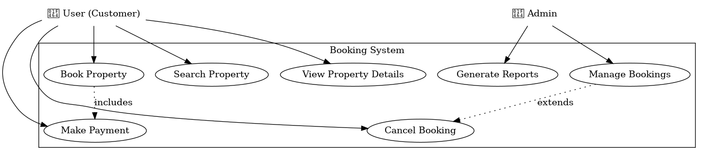

# wireframing
# Wireframing: From Wireframe to Prototype

## Introduction to Wireframing
Wireframing is a crucial part of the UI/UX design process, acting as a blueprint for web and mobile applications. It involves creating visual representations of a page or interface's structure and layout. Wireframes help define the elements of the user interface, ensuring the design meets both functional and usability requirements before development begins. This process helps visualize the core structure and functionality of a product in its early stages.

## Key Elements of Wireframing
Wireframes are composed of several key elements that define how the user interface will be organized. These elements guide designers in creating intuitive and functional layouts for applications.

### Layout Structure
The layout structure defines how components are arranged on the page. It includes the placement of headers, footers, content sections, and sidebars. For example, a booking system might feature a search bar at the top, a list of available rooms, and a prominent booking button to guide users.

### Navigation
Navigation ensures that users can easily move between pages or sections. It includes menus, buttons, and links. In a booking system, for example, navigation could include options for searching rooms, viewing details, and accessing user account information.

### Content Placement
Content placement refers to where text, images, forms, and other elements are placed on the page. Proper content placement ensures that users' attention is drawn to the most important parts of the page. In a booking system, this could involve placing the booking form directly below the list of rooms so that users can easily find it after selecting a room.

### Functionality
Functionality in wireframing represents the interactive elements of the design, such as buttons, forms, and checkboxes. For a booking system, functionality might include search filters, date selectors, and a booking confirmation button.

## Types of Wireframes

### Low-Fidelity Wireframes
Low-fidelity wireframes are basic, simple sketches or digital mockups created in the early stages of design. These wireframes focus on layout and structure without much detail and are ideal for brainstorming or testing concepts.

**When to use:**
- Early-stage ideation and feedback.
- Focus on layout without distracting design details.

### High-Fidelity Wireframes
High-fidelity wireframes are more detailed and closely resemble the final design, including elements like fonts, colors, and precise positioning. These wireframes are typically used for finalizing designs and ensuring that the design aligns with user needs before development.

**When to use:**
- Final stages of design, just before development.
- Detailed representation of the interface and interactions.

## Wireframing Tools

### Figma
Figma is a widely-used web-based design tool that allows designers to create wireframes, prototypes, and high-fidelity designs. It’s collaborative, enabling teams to work together in real-time. Figma supports vector-based design, interactive prototypes, and has a rich set of features tailored for UI/UX design.

**Key Features:**
- Real-time collaboration.
- Vector-based editing.
- Prototyping and interaction design.
- Cloud-based, accessible from anywhere.

## Benefits of Wireframing in Software Development
Wireframing plays a critical role in guiding the design process and ensuring clear communication between designers, developers, and stakeholders. Here’s how it helps:

- **Guides Design Decisions:** Wireframes allow stakeholders to visualize the application structure early in the process, reducing miscommunication and costly design changes later.
- **Facilitates Collaboration:** Wireframes provide a common visual language for designers, developers, and stakeholders, enabling smoother collaboration.
- **Identifies Usability Issues Early:** Testing wireframes with users or team members can help spot usability issues early, saving time and resources during development.

## Wireframing in Practice: A Real-World Scenario
In a real-world scenario for a booking system, a low-fidelity wireframe was used to map out the basic layout of the interface. During the review phase, stakeholders noticed that the booking confirmation button was placed at the bottom of the page, which could cause users to overlook it. After some iterations, the button was repositioned to a more prominent location, ensuring a smoother user experience.

This scenario illustrates how wireframing helped identify and resolve a usability issue before development began, saving time and resources.

## Figma File PNG
Below is the PNG image of the Figma file for the project, showcasing the high-fidelity design prototype.

> *Note: This PNG was exported from the Figma design file. You can explore the full design and prototype in the Figma tool.*

## Conclusion
Wireframing is an essential tool in creating user-centered designs, improving communication, and mitigating risks before development begins. By using wireframes effectively, designers and developers can ensure that applications meet both functional requirements and user expectations. 

---

**Next Steps:**
- Explore wireframing tools like Figma to start building your own wireframes.
- Practice using low-fidelity wireframes early in your design process and transition to high-fidelity wireframes as your design matures.

